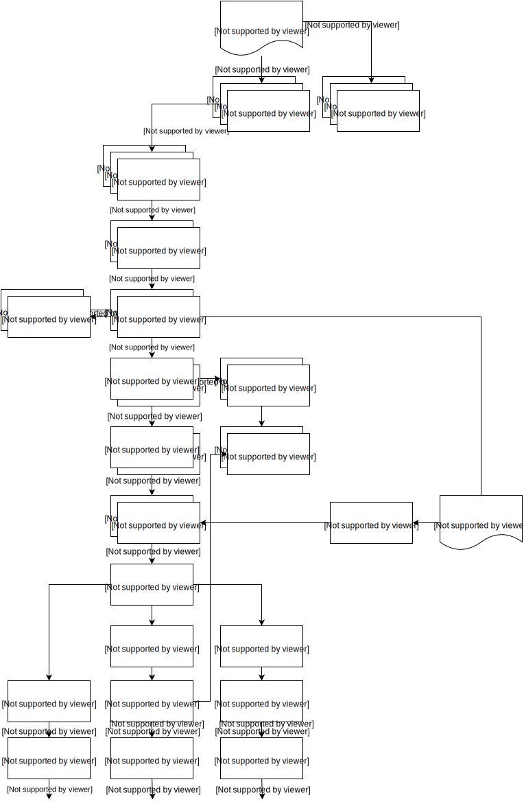

# molgenis-c5-TumorNormal
The main goal is to detect variants in tumor-normal sample combinations.

references will follow:

| Name         | project website                                                                            | Article          |
| ------------ | ------------------------------------------------------------------------------------------ | ---------------- |
| Fastqc       | [bioinformatics.babraham.ac.uk](http://www.bioinformatics.babraham.ac.uk/projects/fastqc/) | |
| bwa          | [github](https://github.com/lh3/bwa)                                                       | [preprint](http://arxiv.org/abs/1303.3997) |
| picard-tools | [picard.sourceforge](http://picard.sourceforge.net/)                                       | [instructions below faq](http://picard.sourceforge.net/) |
| Gatk toolkit | [broadgatk](http://www.broadinstitute.org/gatk/)                                           | [instructions here](https://www.broadinstitute.org/gatk/about/citing-gatk) |
| varscan      | [github](http://dkoboldt.github.io/varscan/)                                               | [pubmed link](http://www.ncbi.nlm.nih.gov/pubmed/22300766) |
| snpeff       | [sourceforge](http://snpeff.sourceforge.net/index.html)                                    |[pubmed](http://www.ncbi.nlm.nih.gov/pubmed/22728672)|
| samtools     | [project home](http://www.htslib.org/)                                                     |[pubmed](http://www.ncbi.nlm.nih.gov/pubmed/19505943)|
| compute      | [http://www.molgenis.org/wiki/ComputeStart]                                                |[citeseerx](http://citeseerx.ist.psu.edu/viewdoc/summary?doi=10.1.1.415.9799)|

Resource links
--------------

The resource links for installing references/preparing them

| name          | site 
| ------------- | ---- 
| GATK Bundle   | [ human reference ](http://gatkforums.broadinstitute.org/discussion/1213/what-s-in-the-resource-bundle-and-how-can-i-get-it)
| Ensembl       | [reference/gtf dowload](http://www.ensembl.org/info/data/ftp/index.html)
| UCSC Tools    | [ format conversion/additional tools ](http://hgdownload.soe.ucsc.edu/admin/exe/)

Workflow
--------

goals:
  - is buildable with easybuild?
  - works on new slurm cluster
  - integrate tumor-normal callers

